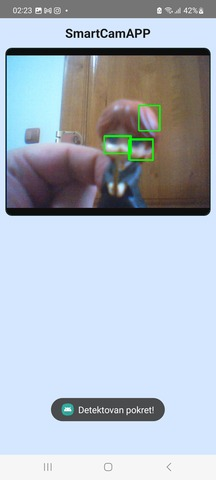
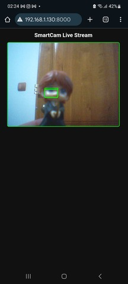

# Orange Pi 5 Pro SmartCam - Flask Motion Detection and Android Aplication

## 📌 Introduction

**SmartCam** is a lightweight, embedded-oriented motion detection system built using **Flask**, **OpenCV**, and optionally an **Android (React Native)** client application.  
It was developed and tested on a **single-board computer (SBC) Orange Pi 5 Pro**, making it suitable for real-world embedded camera applications and edge-processing workloads.

The backend Flask application processes a USB camera feed in real time, detects motion using background subtraction, and logs every motion event with a timestamp. When movement is detected, the system records the event and exposes it through an HTTP endpoint used by client applications for notifications or automation.

A companion **Android mobile application** can be used to view the live video stream and receive real-time motion alerts.  
However, the system does not depend on the app — it also exposes the MJPEG live stream through a standard browser-accessible endpoint.  
This means the user can monitor the camera feed from **any device with a web browser**, without installing additional software.

This project demonstrates core embedded camera concepts:

- Real-time video streaming from a USB camera  
- Motion detection via OpenCV  
- Event logging with timestamps  
- MJPEG streaming over HTTP (browser compatible)  
- Optional mobile monitoring via a React Native Android app  
- System-level camera control via V4L2  
- Deployment on ARM-based SBC hardware (**Orange Pi 5 Pro**)  

**SmartCam** is built as a minimal, modular, and open-source demonstration suitable for embedded engineering interviews or showcasing video-processing, low-level camera control, and system integration skills.

---

## ⚙️ Functionalities

SmartCam provides a set of core functionalities designed for embedded video processing and real-time motion detection:

### 🔹 1. Real-Time Video Streaming
- Streams live video from a USB camera using MJPEG over HTTP.
- Compatible with any modern web browser.
- Can also be consumed by the companion Android app.
- 🔧 System Overview

```
+---------------------------------------------------------------+
|                    Orange Pi 5 Pro (Server)                   |
|                                                               |
|  +-------------------+      +------------------------------+  |
|  | USB Camera (V4L2) | -->  |  Flask Server (app.py)       |  |
|  +-------------------+      |  - Video Stream (MJPEG)      |  |
|                             |  - Motion Detection (OpenCV) |  |
|                             |  - Event Logging (JSON)      |  |
|                             |  - V4L2 Control Module       |  |
|                             +------------------------------+  |
|                                                               |
+--------------- Wi-Fi / Local Network -------------------------+
                                |
                                |
                +-----------------------------------+
                |   Mobile App (React Native)       |
                |   - Displays Live Stream          |
                |   - Polls motion events           |
                |   - Shows notifications           |
                +-----------------------------------+
                                |
                                |
                +-----------------------------------+
                |       Web Browser (Optional)      |
                |       - View live stream          |
                +-----------------------------------+ 
```
### 🔹 2. Motion Detection (OpenCV)
- Uses background subtraction (`MOG2`) to detect motion in real time.
- Applies contour analysis and bounding boxes to highlight detected movement.
- Adjustable sensitivity and noise filtering.

### 🔹 3. Motion Event Logging
- Every motion detection event is recorded with a precise timestamp.
- Events are saved into a local `evidencija.json` file.
- The log can be consumed by external applications or automations.

evidencija.json
```
{
  "timestamp": "2025-11-27T18:21:54.120381",
  "type": "motion"
}
```

### 🔹 4. Real-Time Motion Alerts
- The Android application can poll the backend to detect new motion events.
- Can be integrated with push notifications or SMS gateways (optional extension).

### 🔹 5. Browser-Based Monitoring
- The system does not require a mobile app.
- The live stream can be viewed from any device via:

```
http://<IP_ADDRESS>:8000/
```

### 🔹 6. V4L2 Camera Control
- Low-level camera parameters are adjustable directly from Python.
- Includes support for:
- Power line frequency (50/60 Hz)
- Brightness
- Contrast
- Sharpness
- Implemented through a separate `v4l2_controls.py` module.

### 🔹 7. Embedded SBC Deployment
- Designed and tested on **Orange Pi 5 Pro**.
- Works reliably on ARM-based systems with limited resources.
- Suitable for edge computing and local processing without cloud dependency.

### 🔹 8. Lightweight Flask Backend
- Efficient, threaded video capture for stable streaming.
- Minimal resource usage, suitable for 24/7 operation.
- Easy to extend with additional API endpoints.

SmartCam combines embedded hardware control, image processing, and network communication to form a compact, scalable, and practical surveillance or monitoring solution.

---

## Requirements

### 🟧 Flask Server Requirements

The Flask motion-detection server running on the Orange Pi 5 Pro uses these Python dependencies:


```
Flask==3.1.2
Werkzeug==3.1.3
Jinja2==3.1.6
opencv-python==4.12.0.88
opencv-contrib-python==4.12.0.88
numpy==2.2.6
```
> Note: `v4l2_controls.py` is a local module and is not installed via pip.


### v4l2_controls.py
```v4l2_controls.py``` requires installation of ```v4l-utils``` on your system, so based on your system you need to:
```
# Debian / Ubuntu / BredOS / Raspberry Pi OS
sudo apt install v4l-utils

# Fedora
sudo dnf install v4l-utils

# Arch/Manjaro
sudo pacman -S v4l-utils

# openSUSE
sudo zypper install v4l-utils

```
### 🟩 React Native Requirements

The mobile application requires the following packages:

```
react
react-native
react-native-safe-area-context
react-native-webview
```
---

## ✅ Installation

### 1️⃣ Clone the repository
```
git clone https://github.com/your-username/motion-detection-ip-camera.git
cd motion-detection-ip-camera

```
### 🟧 Flask Server Installation (Orange Pi 5 Pro)
1. Create Python virtual environment
```
python3 -m venv venv
source venv/bin/activate
```
2. Install Python dependencies

```
pip install -r requirements.txt
```
>Note: v4l2_controls.py is a local module, no pip installation required.

3. Start the Flask server
```
python app.py
```


| Endpoint           | Description                |
| ------------------ | -------------------------- |
| `/video_feed`      | MJPEG live video feed      |
| `/evidencija.json` | Motion detection event log |

### 🟩 React Native Mobile App Installation
1. Navigate to mobile folder


2. Install dependencies
```npm install```


Required RN packages:

```ad
react
react-native
react-native-safe-area-context
react-native-webview
```

3. Run the mobile app

For Android:

```npm run android```



>Ensure that the mobile device and Orange Pi are on the same Wi-Fi network.

🖥️ Optional: Browser-based Video Stream

Instead of using the mobile app, open a web browser and navigate to:

```http://<orange-pi-ip>:8000/```


